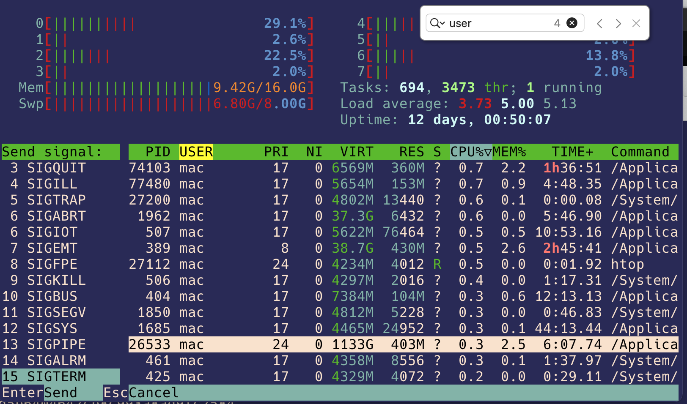

top
### htop #主要用这个
可以用fn+F3 搜索，也可以用Fn+F9杀死一个process

### killall XXX
大规模杀伤，kill all process named after XXX
### kill Pid
you need process id here to kill a specific process

### PS
ps command stands for process& status,
ps only returns the process belong to the root users